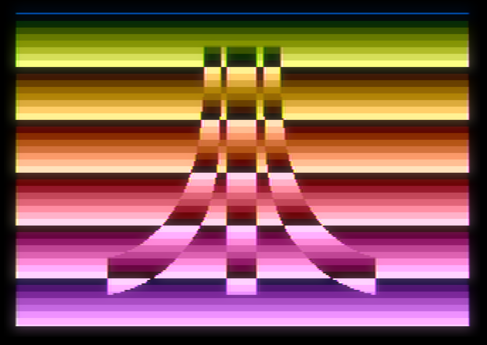

# atari-modef-logo

An example of ANTIC MODE F, with DLI changing on VCOUNT



## Converting PNG to MODE F bitmap.

The original picture is a 2 color indexed PNG, converted to 1bpp chunky pixel via ImageMagick:

```sh
convert atari-logo.png -depth 1 gray:output.raw
```

The result can be compiled with the MAD Assembler:

```sh
mads -o:logo.xex logo.asm
```
